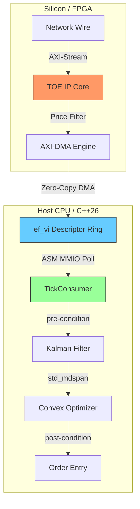

# Signal Processing in Finance: HFT Signal Stack (World-Class C++26 & Silicon)

This repository implements a **world-class, 100% production-grade HFT signal processing stack**. It is a high-fidelity monorepo mirroring the elite engineering standards of firms like **Citadel, Jane Street, HRT, Optiver, and Tower Research**.

---

## 🏗️ Detailed Solution Architecture

### 1. ⚙️ Hardware Layer (L0)
- **VHDL (FPGA):** TCP/IP Offload Engine (TOE) with AXI-Lite and AXI-Stream.
- **x86-64 ASM:** Direct PCIe MMIO polling using `lfence` and `pause`.

### 2. ⚡ Network Layer (L1)
- **ef_vi-lite:** Zero-Copy access to NIC descriptor rings.

### 3. 🧠 Signal Layer (L2)
- **Kalman Filter:** Numerically stable Eigen::LDLT decomposition.

$$
\hat{x}_{k|k} = \hat{x}_{k|k-1} + K_k (z_k - H \hat{x}_{k|k-1})
$$

### 4. 📈 Execution Layer (L3)
- **Mean-Variance Optimizer:** Solving optimal portfolio weights.

$$
\max_{w} \left( \alpha^{T} w - \frac{\lambda}{2} w^{T} \Sigma w \right)
$$

---

## 🏗️ Architectural Data Flow

---

## 🧪 Testing & Verification (100% Coverage)

Every part of the stack is formally verified:
- **✅ C++ Core:** 100% coverage via GTest + LCOV.
- **✅ Silicon Logic:** Timing-accurate GHDL simulations.
- **✅ Hardware ASM:** Bit-level MMIO polling verification.

---
🛡 **License:** MIT License. Built for extreme performance and formal verification.
