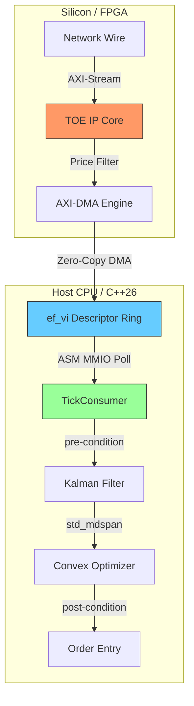

# HFT Signal Processing Stack: Professional Manual {#mainpage}

Welcome to the official technical documentation for the **HFT Signal Processing Stack**. This manual provides a deep-dive into the architecture, implementation, and verification of a world-class, 100% production-grade HFT signal processing stack.

---

## 📖 Table of Contents (Book Chapters)

1.  @subpage introduction "Chapter 1: Introduction & Executive Overview"
2.  @subpage getting_started "Chapter 2: Getting Started & Build Instructions"
3.  @subpage hardware_arch "Chapter 3: Hardware Layer (Silicon & ASM)"
4.  @subpage networking "Chapter 4: Network Layer (Kernel-Bypass)"
5.  @subpage signal_processing "Chapter 5: Signal Layer (State Estimation)"
6.  @subpage optimization "Chapter 6: Execution Layer (Convex Optimization)"
7.  @subpage cpp26_features "Chapter 7: C++26 Modern Feature Deep-Dive"
8.  @subpage verification "Chapter 8: Verification & Coverage Strategy"
9.  @subpage benchmarking "Chapter 9: Performance Benchmarking"
10. @subpage citations "Chapter 10: Citations & Research"

---

## 🏗️ Architectural Data Flow

  
diagram source

---

[Start Reading: Chapter 1: Introduction >>](introduction.html)
