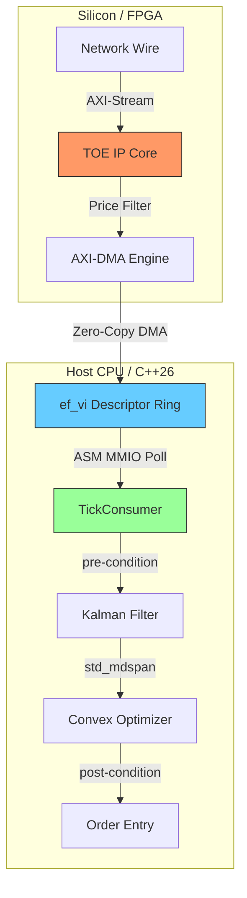

# Chapter 1: Introduction & Executive Overview {#introduction}

[Back to Table of Contents](index.html) | [Next Chapter: Getting Started >>](getting_started.html)

---

## 🏗️ Vision & Architecture

The **HFT Signal Processing Stack** is a high-fidelity monorepo mirroring the elite engineering standards of top-tier quantitative trading firms. It implements a complete "Tick-to-Trade" pipeline, co-designed for extreme performance.

### The Problem Space
In modern high-frequency trading (HFT), every nanosecond counts. Standard OS networking stacks and generic signal processing libraries introduce non-deterministic jitter and latency. This project demonstrates how to bypass these bottlenecks using:
- **Hardware/Software Co-design:** Moving critical filters to silicon (VHDL).
- **Kernel Bypass:** Direct hardware access from userspace (ef_vi).
- **Modern C++:** Leveraging C++26 for zero-overhead abstractions.

### Architectural Data Flow

---

[Back to Table of Contents](index.html) | [Next Chapter: Getting Started >>](getting_started.html)
