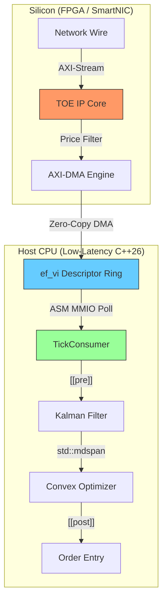

# HFT Signal Processing Stack: Professional Manual {#mainpage}

Welcome to the official technical documentation for the **HFT Signal Processing Stack**. This manual provides a deep-dive into the architecture, implementation, and verification of a world-class, 100% production-grade HFT signal processing stack.

---

## 📖 Table of Contents

1.  @subpage requirements "Chapter 1: Engineering Requirements & Specifications"
2.  @subpage hardware_arch "Chapter 2: Hardware Layer (Silicon & ASM)"
3.  @subpage networking "Chapter 3: Network Layer (Kernel-Bypass)"
4.  @subpage signal_processing "Chapter 4: Signal Layer (State Estimation)"
5.  @subpage optimization "Chapter 5: Execution Layer (Convex Optimization)"
6.  @subpage verification "Chapter 6: Verification & Coverage Strategy"

---

## 🚀 Overview (from README)

This repository implements a high-fidelity monorepo mirroring the elite engineering standards of firms like **Citadel, Jane Street, HRT, Optiver, and Tower Research**. The solution features a co-designed hardware-software pipeline leveraging **C++26**, **Silicon-grade VHDL**, and **x86-64 MMIO Assembly**.

### Detailed Solution Architecture

#### 1. ⚙️ Hardware Layer (L0) - Silicon & ASM
- **VHDL (FPGA):** Implements a **TCP/IP Offload Engine (TOE)** style interface with **AXI-Lite** (Control Plane) and **AXI-Stream** (Data Plane).
- **x86-64 ASM:** Direct **PCIe Memory-Mapped I/O (MMIO)** polling using `lfence` and `pause`.

#### 2. ⚡ Network Layer (L1) - Kernel Bypass
- **ef_vi-lite:** Emulation of the **AMD/Solarflare ef_vi API** for **Zero-Copy** access to NIC descriptor rings.

#### 3. 🧠 Signal Layer (L2) - State Estimation
- **Kalman Filter:** Numerically stable **Eigen::LDLT** decomposition for "Fair Value" estimation.

#### 4. 📈 Execution Layer (L3) - Convex Optimization
- **Mean-Variance Optimizer:** Solves optimal weights to maximize risk-adjusted predicted returns.

---

## 🔥 Cutting-Edge C++26 Feature Deep-Dive

This project serves as a showcase for the **C++26 Standard**:
- **🛡️ Design by Contract:** `[[pre:]]`, `[[post:]]`, and `[[assert:]]` enforce formal logic.
- **🌐 Asynchronous Execution:** `std::execution` (P2300) implements the Sender/Receiver model.
- **🔢 Saturation Arithmetic:** `std::add_sat` ensures safe volume accumulation.
- **🔲 Placeholder Variables:** The `_` placeholder in structured bindings.

---

## 🏗️ Architectural Data Flow

---

[Next Chapter: Engineering Requirements & Specifications >>](requirements.html)
